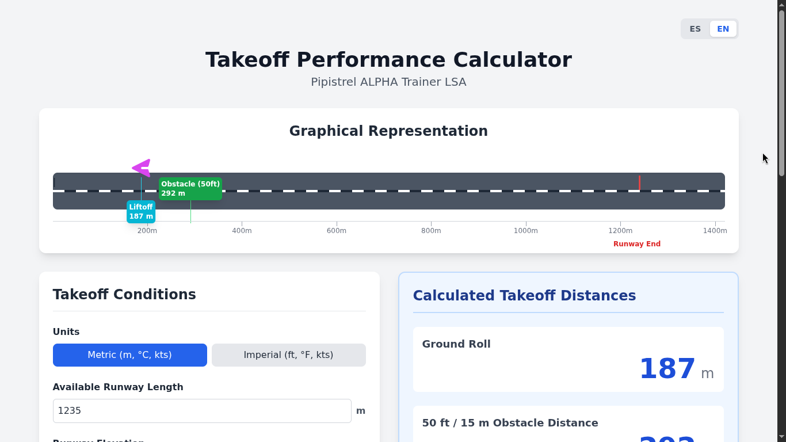
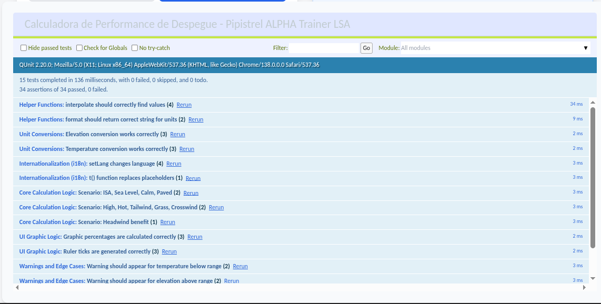

# Takeoff Performance Calculator - Pipistrel ALPHA Trainer


An interactive and visual web-based calculator to estimate the takeoff performance of the **Pipistrel ALPHA Trainer (LSA)** aircraft.



---

> ⚠️ **IMPORTANT DISCLAIMER & WARNING**
>
> This calculator is an **educational and demonstrational tool only**. **DO NOT USE IT FOR REAL-WORLD FLIGHT PLANNING.**
>
> This is an **unofficial, third-party tool**. The author is not affiliated with, endorsed by, or sponsored by Pipistrel or its parent company, Textron Aviation.
>
> The calculations are based on performance data from the following specific document:
> - **Document No.:** POH-162-00-40-001
> - **Revision:** A07
> - **Date of Issue:** June 5th, 2024
>
> Always consult the official and current **Pilot's Operating Handbook (POH)** for your specific aircraft for accurate and authoritative performance data. **Any questions regarding the application of these calculations or the use of this tool in a training context should be directed to a qualified Certified Flight Instructor (CFI).**
>
> The author assumes no liability for any decisions made or actions taken based on the use of this tool.

---

## ✨ Key Features

*   **📊 Interactive Graph:** Visualize the ground roll, 50 ft obstacle clearance distance, and available runway length in a real-time updating graphical representation.
*   **🌐 Bilingual Support:** The interface is available in both English and Spanish, with automatic browser language detection.
*   **🔢 Flexible Inputs:** Adjust all key variables: elevation, temperature, headwind/tailwind, crosswind, and runway surface type.
*   **📏 Imperial & Metric Units:** Switch between unit systems with a single click.
*   **🔬 Calculation Breakdown:** Understand how the final result is achieved with a detailed section showing each step of the calculation, from the base distance to adjustments for density, wind, and surface.
*   **📱 Responsive Design:** Fully functional on both desktop and mobile devices.
*   **🚀 Self-Contained:** Built with a lightweight stack that runs entirely in the browser, with no server-side processing or external production dependencies.

## 🛠️ Tech Stack

*   **HTML5** (Semantic)
*   **[Tailwind CSS](https://tailwindcss.com/)** for rapid, modern UI development.
*   **[Alpine.js](https://alpinejs.dev/)** for UI reactivity and application logic.

## ⚙️ How It Works (The Calculation Logic)

The calculation is based on the interpolation method from the performance charts found in the Pipistrel ALPHA Trainer POH. The process is as follows:

1.  **Base Distance (Lo):** Starts with the standard distance at Sea Level (SL) and 15°C (ISA).
2.  **Density Correction:**
    *   Interpolates the distance for the current **temperature** at sea level (Lt).
    *   Interpolates the distance for the current **elevation** at 15°C (Lh).
    *   Combines these effects (`Lh + Lt - Lo`) to get the density altitude-corrected distance.
3.  **Safety Margin:** A 10% safety margin is applied to the density-corrected distance.
4.  **Wind Adjustment:** A fixed distance is added or subtracted based on the headwind or tailwind component.
5.  **Correction Factors:** The result is then multiplied by factors for:
    *   **Runway Surface** (+20% for grass/soft field).
    *   **Crosswind** (+10% for every 5 knots of crosswind).
6.  **Final Result:** The final ground roll and 50 ft / 15 m obstacle clearance distances are displayed.

## 🚀 Running Locally

No build process is required. Simply clone or download the repository and open the `index.html` file in your web browser.

```bash
# Clone the repository
git clone https://github.com/carlosplanchon/takeoff_performance_piat.git

# Navigate to the directory
cd takeoff_performance_piat

# Open the index.html file in your preferred browser
```

## 🧪 Testing

The project includes an in-browser test suite using **[QUnit](https://qunitjs.com/)** to verify the calculation logic.

### How to Run the Tests

The test suite is disabled by default for a clean user experience. To activate it, open the `index.html` file in your browser and add the `?test=true` parameter to the URL.

**Example URL:**
`file:///path/to/your/project/index.html?test=true`

This will display the QUnit test runner at the bottom of the page, showing the results of all test cases.



### Current Test Coverage

The existing test suite validates several key areas of the application to ensure reliability and correctness:

1.  **Core Calculation Logic:** This is the most critical set of tests, covering different operational scenarios to verify the accuracy of the performance calculations. The current scenarios are:
    *   **Standard Conditions (ISA):** Checks the baseline performance at Sea Level, 15°C, with a paved runway and no wind. This validates that the base POH numbers and the safety margin are applied correctly.
    *   **Adverse Conditions:** Simulates a challenging "High and Hot" scenario with high elevation, high temperature, a tailwind, a crosswind, and a grass runway. This tests the combined effect of all negative performance factors.
    *   **Favorable Conditions:** Verifies that a strong headwind correctly reduces the calculated takeoff distances, ensuring that positive performance factors are also handled properly.

2.  **Edge Cases and POH Limits:** This module ensures the calculator behaves safely and predictably when user inputs approach or exceed the limits of the data provided in the POH.
    *   **Out-of-Bounds Warnings:** Confirms that a clear warning message is generated and displayed if the user selects a temperature or elevation outside the valid range specified in the POH tables.
    *   **Multiple Warnings:** Checks that the system can handle and display several warnings simultaneously if multiple inputs are out of bounds.
    *   **Valid Conditions:** Ensures that no warnings are displayed when all inputs are within the valid POH range.

3.  **Helper Functions & Unit Conversions (Implicit):** The tests implicitly validate foundational functions by relying on them for the main calculations. This includes:
    *   `interpolate()`: The core function for reading values from the performance charts.
    *   Unit Conversion Getters/Setters: The correct conversion between metric and imperial units for temperature and elevation is indirectly verified through the setup of the test scenarios.

This structured testing approach ensures that the main logic is not only mathematically correct according to the POH methodology but also that the user interface provides appropriate feedback for safe and responsible use.

### How to Add a New Test Scenario

Contributions to expand test coverage are highly encouraged. To add a new test scenario:

1.  **Locate the Test Suite:** Open `index.html` and find the `<script id="test-suite-script">` tag at the end of the `<body>`.
2.  **Find the Module:** Inside the `runTests()` function, locate the `QUnit.module('Core Calculation Logic', ...)` block.
3.  **Add a New `QUnit.test`:** Copy an existing test case or create a new one following this template:

    ```javascript
    QUnit.test('Scenario: [Your New Scenario Description]', function(assert) {
        // 1. Set the conditions for your scenario
        this.calculator.elevation_ft = ...;
        this.calculator.temperature_c = ...;
        this.calculator.wind_kts = ...; // Use negative for tailwind
        this.calculator.crosswind_kts = ...;
        this.calculator.runwaySurface = 'paved' or 'grass';

        // 2. Execute the calculation
        this.calculator.calculate();

        // 3. Define the expected results
        // It's highly recommended to calculate this manually first based on the POH
        // to validate the code against an external source of truth.
        const expectedGroundRoll = ...;
        const expectedObstacle = ...;

        // 4. Assert that the results are within an acceptable tolerance
        assert.ok(Math.abs(this.calculator.results.groundRoll - expectedGroundRoll) < 1, 'Validation message for ground roll');
        assert.ok(Math.abs(this.calculator.results.obstacle - expectedObstacle) < 1, 'Validation message for obstacle distance');
    });
    ```

4.  **Verify:** Save the `index.html` file and reload your browser with the `?test=true` parameter to see your new test run.


## 🤝 Contributing

Contributions are welcome! If you find a bug, have a suggestion for improvement, please open an *Issue* or submit a *Pull Request*.

## 📄 License

This project is distributed under the MIT License. See the `LICENSE` file for more information.

---
*Made with ♥️ in Dolores, Soriano, Uruguay.*
